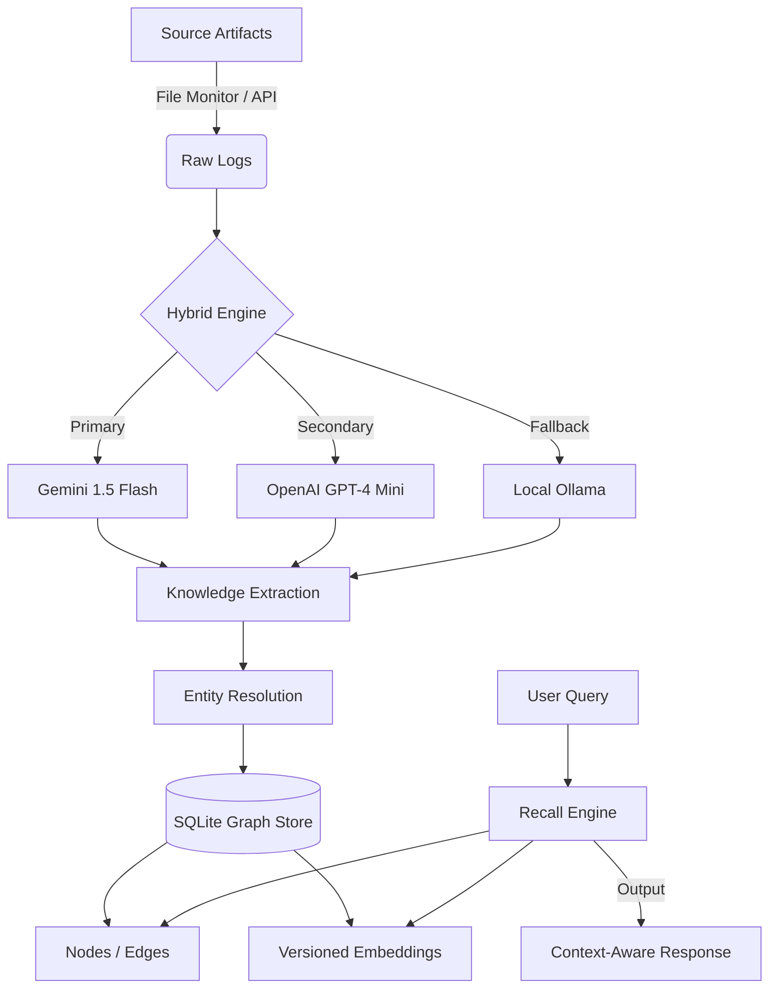

# 🧠 Portable Cognitive Memory (PCG)

> **Transforming raw digital artifacts into a persistent, evolving knowledge graph.**

[](https://www.python.org/downloads/)
[](https://fastapi.tiangolo.com/)
[](https://reactjs.org/)
[](https://opensource.org/licenses/MIT)

**Portable Cognitive Memory (PCG)** is a local-first cognitive memory system. It ingests your daily work logs, codebases, and project notes, extracting not just text, but **conceptual relationships, decision-making logic, and system mechanisms**. The result is a portable knowledge graph that can be queried by AI agents (like JARVIS) to recall context across different models and tools.

---

## 🚀 Key Features

*   **⚡ Hybrid Ingestion Engine (v2)**: Intelligently switches between **Gemini 1.5 Flash**, **OpenAI GPT-4 Mini**, and **Local Ollama** to bypass rate limits and ensure 100% ingestion uptime.
*   **🔗 Cognitive Graph Extraction**: Moves beyond simple "A contains B" links. Extracts high-value relationships like `mitigates`, `enables`, `prioritizes`, and `suffers_from`.
*   **🌌 3D Neural Interface**: High-performance, cinematic 3D force-directed graph built with Three.js. Features strict taxonomy coloring, dynamic gravity clustering, and real-time synaptic data flow.
*   **📂 Local-First / Portable**: Uses SQLite for simplicity and portability. Your memory belongs to you.
*   **🔍 Semantic + Graph Retrieval**: Combines vector similarity search with N-hop graph expansions for contextually rich recall.
*   **🛠️ Deterministic Rebuilds**: Uses `raw_logs` as the source of truth, allowing you to re-extract your entire graph if you change extraction logic or providers.

---

## 🏗️ System Architecture



---

## 🛠️ Tech Stack

### Backend
- **Framework**: FastAPI (Async)
- **Database**: SQLAlchemy + SQLite (aiosqlite)
- **AI Integration**: Google Generative AI, OpenAI, Ollama
- **Storage**: Vector-aware graph schema with versioned embeddings
- **Auth**: JWT with per-user isolation

### Frontend
- **Framework**: React + Vite
- **Styling**: Tailwind CSS (Aurora & Neural Aesthetics)
- **Visualization**: `react-force-graph-3d` + `three.js`
- **Features**: Semantic Edge Filtering, Cinematic Orbit, Dynamic Physics, Context Panel

---

## ⚙️ Setup & Installation

### 1. Prerequisites
- Python 3.10+
- Node.js 18+
- Ollama (Optional, for local fallback)

### 2. Backend Setup
```bash
cd Backend
python -m venv venv
source venv/bin/activate  # Or `venv\Scripts\activate` on Windows
pip install -r requirements.txt
```

Create a `.env` file in the `Backend` directory:
```env
DATABASE_URL="sqlite+aiosqlite:///./pcg.db"
LLM_PROVIDER="gemini"
OPENAI_API_KEY="your_key"
GEMINI_API_KEY="your_key"
```

### 3. Frontend Setup
```bash
cd Frontend
npm install
npm run dev
```

---

## 📖 Usage

### Running the Ingestion Engine
To process all project files and history using the hybrid approach:
```bash
cd Backend
python ingest_hybrid.py
```

### CLI Commands
The project includes a robust CLI for management:
```bash
# Initialize the database
python -m pcg initdb

# Start the API server
python -m pcg serve

# Rebuild the graph from logs
python -m pcg rebuild <user_id>
```

---

## 🧠 Extraction Philosophy

PCG is built to model **Cognition**, not just **Structure**.

| Aspect | Good (Cognitive) | Bad (Structural) |
| :--- | :--- | :--- |
| **Relation** | `Deduplication -> prevents -> node_clutter` | `App -> uses -> SQLite` |
| **Relation** | `Embeddings -> enable -> semantic_search` | `Backend -> contains -> routes` |
| **Focus** | Decisions, Trade-offs, Mechanisms | Class hierarchies, File structures |

---

## 🛡️ License
MIT License. Built for personal cognitive sovereignty.

---
👉 *Status: Hybrid Ingestion v2 is active. 3D Neural Interface (Frontend) is fully deployed and optimized.*
